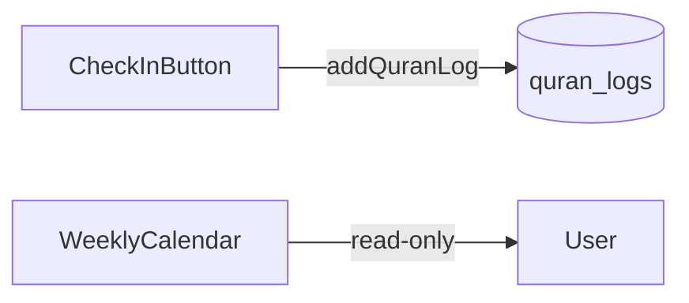
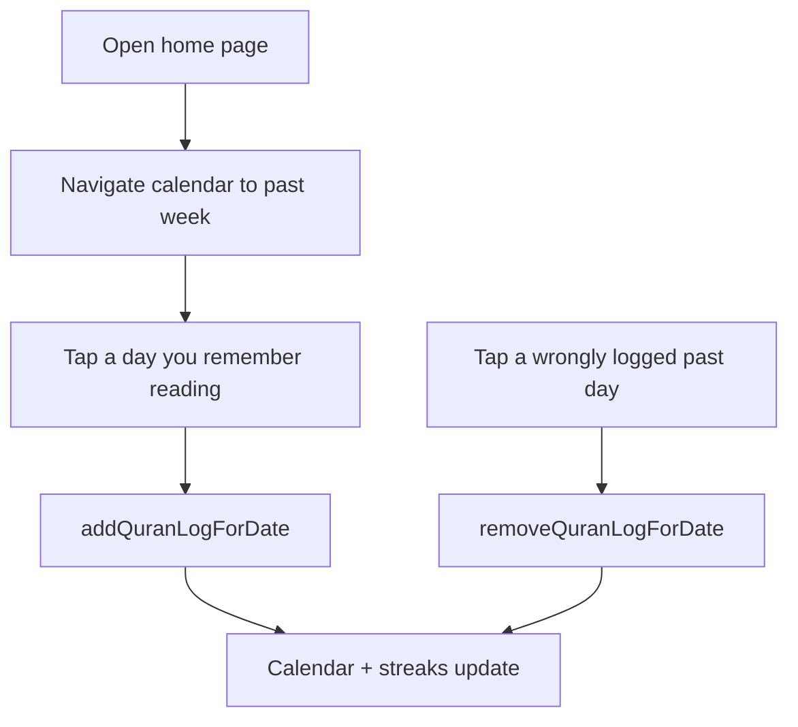

# Backfill Past Reading Days

## Current state

The app tracks **daily yes/no check-ins** only. [`quran_logs`](src/db/schema.ts) already has a `date` column (`YYYY-MM-DD`), but [`addQuranLog()`](src/server/actions.ts) always writes **today** and the [`WeeklyCalendar`](src/components/weekly-calendar.tsx) is **display-only**.



## Recommended approach: tap days on the calendar

The simplest UX that fits the app: **navigate to the week, tap any past day you remember reading**. This reuses the calendar you already have — no new pages, forms, or schema.

- **Unread past/today days** → tap to log
- **Already logged days** → tap to remove (fixes mistakes; only for days before today)
- **Future days** → disabled
- **Today's big button** → unchanged as the primary daily habit cue

This is better than a separate "Add past day" date-picker modal because:
- Zero new UI patterns to learn
- [`react-day-picker`](src/components/ui/calendar.tsx) is already installed
- Week navigation already exists for going back in time
- No database migration

## Implementation

### 1. Extend server actions — [`src/server/actions.ts`](src/server/actions.ts)

Add two focused actions (keep `addQuranLog()` as-is for the today button):

**`addQuranLogForDate(date: string)`**
- Require auth + timezone (reuse `requireClerkUserWithTimezone`)
- Validate `date` is `YYYY-MM-DD`, not after `todayInTimezone(timezone)`
- Reject if row already exists (same unique constraint handling as today)
- Return updated `{ currentStreak, longestStreak, logDates }` so the calendar can refresh

**`removeQuranLogForDate(date: string)`**
- Same auth/timezone checks
- Only allow dates **strictly before today** (today stays managed by the check-in button)
- Delete row for `(userId, date)`
- Return updated streaks + dates

Also expose `today` from `getHomeData()` so the client knows which days are clickable vs removable.

### 2. Make the calendar interactive — [`src/components/weekly-calendar.tsx`](src/components/weekly-calendar.tsx)

Convert to a client component that accepts `readDates`, `today`, and handles clicks:

```tsx
onDayClick={(date) => {
  const dateStr = format(date, "yyyy-MM-dd")
  if (dateStr > today) return           // future: ignore
  if (readSet.has(dateStr)) {
    if (dateStr < today) removeQuranLogForDate(dateStr)
  } else {
    addQuranLogForDate(dateStr)
  }
  router.refresh()
}}
```

Visual cues (minimal):
- Past unread days: `cursor-pointer` + hover ring
- Logged days: keep current primary fill
- Future days: `opacity-50`, no pointer

Use existing toast patterns from [`check-in-button.tsx`](src/components/check-in-button.tsx) for success/error feedback.

### 3. Wire props on home page — [`src/app/page.tsx`](src/app/page.tsx)

Pass `today` from `getHomeData()` into `WeeklyCalendar`:

```tsx
<WeeklyCalendar readDates={readDates} today={today} />
```

### 4. Tests — [`src/server/actions.ts`](src/server/actions.ts) validation + existing streak tests

Add unit tests for date validation logic (extract a small pure helper like `isLoggableDate(date, today)` in [`src/lib/dates.ts`](src/lib/dates.ts)):
- Past date → allowed
- Today → allowed via calendar (button also works)
- Future date → rejected
- Remove today → rejected

Existing [`streak.test.ts`](src/lib/streak.test.ts) needs no changes — backfilled dates automatically improve `longestStreak` and may restore `currentStreak` if they fill gaps.

## What this does NOT include (kept out for simplicity)

- Surah/juz/page tracking (different feature, needs new schema)
- Bulk import / CSV upload
- Changing timezone after onboarding (separate settings task)
- Full month view (week nav is enough for MVP; can expand later if backfilling many weeks feels slow)

## User flow after change



## Files to change

| File | Change |
|------|--------|
| [`src/server/actions.ts`](src/server/actions.ts) | Add `addQuranLogForDate`, `removeQuranLogForDate`; return `today` from `getHomeData` |
| [`src/lib/dates.ts`](src/lib/dates.ts) | Add `isLoggableDate(date, today)` helper |
| [`src/components/weekly-calendar.tsx`](src/components/weekly-calendar.tsx) | Day click handlers, loading state, visual states |
| [`src/app/page.tsx`](src/app/page.tsx) | Pass `today` prop |
| [`src/lib/dates.test.ts`](src/lib/dates.test.ts) | Tests for date validation helper |

No migration, no new dependencies, no new routes.
