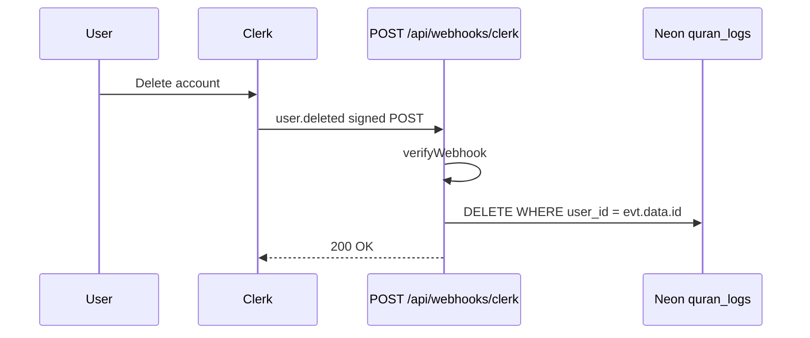

# Delete `quran_logs` when a Clerk account is deleted

`quran_logs.user_id` is a Clerk user id with **no foreign key** ([src/db/schema.ts](src/db/schema.ts)). Clerk owns identity; deleting an account in Clerk does not touch Neon. The previous `user.created` webhook was removed in the timezone-onboarding work. Bring back a **narrower** webhook that only handles `user.deleted`.



## Handler

Add [src/app/api/webhooks/clerk/route.ts](src/app/api/webhooks/clerk/route.ts):

- `POST` only.
- Verify with `verifyWebhook` from `@clerk/nextjs/webhooks` (already in `@clerk/nextjs` v7). It reads `CLERK_WEBHOOK_SIGNING_SECRET`. **Do not skip verification.**
- If `evt.type === "user.deleted"` and `evt.data.id` is present, run:

```ts
await db.delete(quranLogs).where(eq(quranLogs.userId, id))
```

- Ignore other event types (return 200).
- Invalid signature → 400. DB failure → 500 so Svix retries. Delete of zero rows is success (idempotent).
- Do not call `auth.protect()` here; Clerk’s POST has no user session.

[src/proxy.ts](src/proxy.ts) already uses `clerkMiddleware()` **without** `auth.protect()`, so the route is already reachable. Do **not** switch to protect-all-except-webhooks; that would change page auth (signed-out users currently see the layout sign-in UI). Leave proxy as-is.

Reuse [src/db/db.ts](src/db/db.ts) and `eq` from drizzle-orm. The existing unique index on `(user_id, date)` is enough for `WHERE user_id = $1`; no schema change.

## Clerk Dashboard (manual)

1. Webhooks → endpoint URL `https://<prod-host>/api/webhooks/clerk` (local: Clerk CLI tunnel or similar).
2. Subscribe to **`user.deleted` only**.
3. Put the endpoint **Signing Secret** in `CLERK_WEBHOOK_SIGNING_SECRET` (already present in local `.env` from the old webhook; add the same var in Vercel for production).
4. If users should self-delete: enable account deletion in Clerk and keep `<UserButton />` ([src/components/home-header.tsx](src/components/home-header.tsx)) so “Manage account” can delete; Dashboard/admin deletes also fire the same event.

Local listen (after the route exists):

```sh
clerk webhooks listen --token "$(clerk webhooks token)" --forward-to http://localhost:3000/api/webhooks/clerk
```

Register the printed `https://webhooks.clerk.com/in/...` URL in the Dashboard.

## Existing orphaned rows (optional, one-off)

The webhook only covers **future** deletions. Rows for accounts already gone stay until cleaned. If needed later: compare distinct `quran_logs.user_id` to Clerk `users.getUserList()` and delete unknowns. Not required for the feature to work going forward.
