# Quran Tracker: Maintainability & Hiring-Readiness Roadmap

## Current posture

You already have the hard part: a real full-stack app with Clerk auth, Neon/Drizzle persistence, timezone-correct “today,” pure streak math, and GDPR-style cleanup on `user.deleted`. That domain care is stronger than most CRUD portfolio apps.

What weakens the first impression: template [README.md](README.md), no tests/CI, no migrations in repo, informal product copy, and a few small code smells (duplicate home queries, unused `longestStreak`, filename typo). Reviewers often bounce before they reach the good domain logic.

**Default strategy:** packaging + engineering hygiene first, then a thin layer of product polish. Do **not** chase feature sprawl—small + correct + well-framed beats a half-finished mega-app.

```mermaid
flowchart LR
  subgraph phase1 [Phase 1 Packaging]
    Tests[Unit tests]
    CI[GitHub Actions]
    Docs[README and env example]
    Mig[Drizzle migrations]
  end
  subgraph phase2 [Phase 2 Code hygiene]
    Fetch[Consolidate home fetch]
    Dead[Surface or drop longestStreak]
    Rename[Rename calendar file]
    Shells[loading and error UI]
  end
  subgraph phase3 [Phase 3 Showcase]
    Demo[Live demo link]
    Meta[SEO metadata]
    Copy[Tighten product copy]
    Story[Architecture blurb]
  end
  phase1 --> phase2 --> phase3
```

---

## Phase 1 — Table stakes (highest ROI for hiring managers)

These signal “ships software,” not “toy weekend project.”

### 1. Unit-test the pure domain core
- Add Vitest (lightweight, fits Next + TS).
- Cover [`src/lib/streak.ts`](src/lib/streak.ts) and [`src/lib/dates.ts`](src/lib/dates.ts): current/longest streak edge cases, DST-safe day walking, timezone calendar-day boundaries.
- Add scripts: `test`, `test:watch`.
- **Why it impresses:** You already designed for testability; shipping the tests proves intentional engineering.

### 2. CI on every PR
- Add `.github/workflows/ci.yml`: `pnpm install` → `typecheck` → `lint` → `test` → `build`.
- You already have `typecheck` / `lint` / `build` in [`package.json`](package.json); wire them up.
- **Why it impresses:** Green checks on GitHub are a low-effort seniority signal.

### 3. Product README + `.env.example`
Rewrite [README.md](README.md) away from the shadcn template into:
- What it is (1–2 sentences) + live demo URL
- Screenshot(s)
- Stack table (Next 16, Clerk, Neon, Drizzle, Tailwind 4)
- Architecture (Clerk owns identity/timezone metadata; Neon stores only `quran_logs`; streaks derived from logs; webhook deletes on account removal)
- Local setup + required env vars
- Keep the Clerk webhook section, cleaned up (fix “genreated”, remove duplicate local-testing blocks)

Add `.env.example` for: `DATABASE_URL`, `NEXT_PUBLIC_CLERK_*`, `CLERK_SECRET_KEY`, `CLERK_WEBHOOK_SIGNING_SECRET`.

### 4. Commit Drizzle migrations
- Generate and commit migrations under `drizzle/` (config already points there via [`drizzle.config.ts`](drizzle.config.ts)).
- Prefer `db:migrate` over `db:push` in docs for production narrative.
- **Why it impresses:** Shows schema history awareness, not “push and pray.”

---

## Phase 2 — Maintainability fixes (code that reviews well)

Small, concrete cleanups in existing code—no new product surface.

| Fix | Where | Why |
|-----|--------|-----|
| Single home data load | [`src/app/page.tsx`](src/app/page.tsx) + [`src/server/actions.ts`](src/server/actions.ts) | Today `getHomeStreak` and `getQuranLogs` both load all dates; merge into one query/action |
| Use or remove `longestStreak` | [`src/lib/streak.ts`](src/lib/streak.ts), home UI | Dead return path looks unfinished; surface “best streak” or delete it |
| Rename `weekly-calender.tsx` → `weekly-calendar.tsx` | `src/components/` | Typo reads as carelessness |
| Webhook log noise | [`src/app/api/webhooks/clerk/route.ts`](src/app/api/webhooks/clerk/route.ts) | One structured log path; avoid double `console.log` |
| Route shells | `loading.tsx` / `error.tsx` under `src/app/` | Basic App Router polish |
| Drop empty scaffold noise | `src/hooks/.gitkeep`, unused stubs | Less template residue |
| Harden DB env | [`src/db/db.ts`](src/db/db.ts) | Fail clearly if `DATABASE_URL` missing instead of `!` only |

Optional later (lower priority): light Zod (or similar) on `saveTimezone` FormData; keep validation thin—don’t over-abstract a one-table app.

---

## Phase 3 — Showcase polish (impress without feature bloat)

### Product framing
- App metadata (`title`, `description`) in [`src/app/layout.tsx`](src/app/layout.tsx)—currently missing.
- Tighten informal copy (e.g. check-in CTA) so the UI matches the seriousness of the timezone/streak logic.
- Deploy a stable demo URL and pin it at the top of the README.

### What *not* to add (unless you have spare time)
Avoid turning this into a second product. Low ROI for hiring narrative relative to Phases 1–2:
- Social feeds, leaderboards, heavy analytics dashboards
- Native apps / PWA as a “must”
- Rewriting auth or swapping DB for novelty

### High-signal feature *if* you want one product beat
Pick **at most one** that deepens the existing story:
- **History / longest streak on home** (uses logic you already wrote), or
- **Simple stats page** (days read this month, longest streak)—still logs-as-source-of-truth

That reinforces “I thought about correctness and UX,” not “I bolted on features.”

---

## How to talk about this in interviews

Lead with constraints you solved, not the stack list:

1. **Timezone-correct daily habit** — “today” is IANA-local; DST-safe day math in [`src/lib/dates.ts`](src/lib/dates.ts)
2. **Logs as source of truth** — no denormalized streak columns; pure functions in [`src/lib/streak.ts`](src/lib/streak.ts)
3. **Identity vs data** — Clerk metadata for timezone; Neon only for logs; verified webhook cleanup
4. **Race-safe check-in** — unique `(userId, date)` + `23505` handling in actions

After Phase 1, you can add: “covered with unit tests and CI.”

---

## Suggested sequencing (practical order)

1. Vitest + streak/date tests  
2. GitHub Actions CI  
3. README + `.env.example` + demo link  
4. Commit migrations  
5. Consolidate home fetch + longest streak UI (or remove)  
6. Rename calendar file + loading/error + metadata/copy polish  

Stop when the README + demo + green CI tell a clear story; extra features only if the narrative still feels thin.
