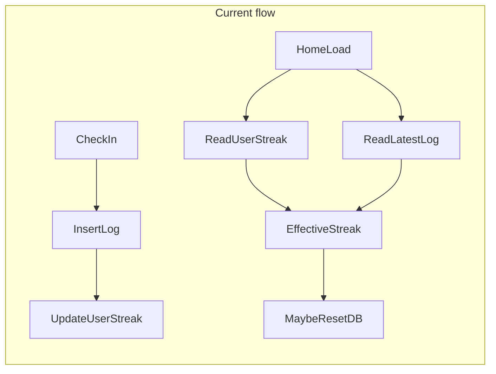
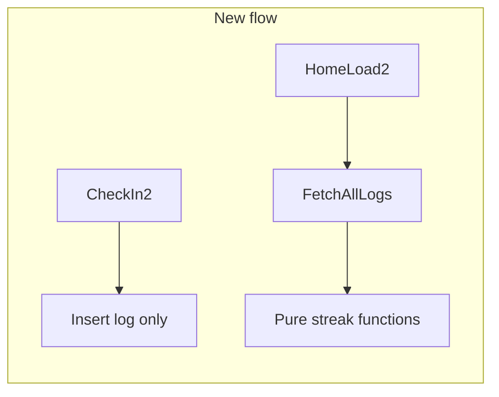

# Logs as source of truth for streaks

## Current state

Streaks are duplicated: written on check-in in [`addQuranLog`](src/server/actions.ts), read on home load in [`getHomeStreak`](src/server/actions.ts), and partially corrected by [`effectiveStreak`](src/lib/streak.ts) when a user misses a day without opening the app.

Only [`page.tsx`](src/app/page.tsx) consumes streak data (`currentStreak`, `checkedInToday`). [`HomeHeader`](src/components/home-header.tsx) shows current streak only; `longestStreak` is returned but not displayed. UI components need no changes if action return shapes stay the same.

## Target architecture

`quran_logs.date` (YYYY-MM-DD in the user's timezone) is the only source of truth for streak numbers. `users.current_streak` / `users.longest_streak` remain in the schema and database as unused columns — **no Drizzle generate/migrate/push**.

## 1. Add pure streak calculation in [`src/lib/streak.ts`](src/lib/streak.ts)

Replace `nextStreak` and `effectiveStreak` with log-derived functions:

**`previousCalendarDay(date: string): string`** — add to [`src/lib/dates.ts`](src/lib/dates.ts), reusing the UTC calendar arithmetic already in `yesterdayInTimezone` (lines 33–38). Used to walk backward one day at a time without DST issues.

**`currentStreak(logDates: string[], today: string, yesterday: string): number`**

- Build a `Set` of log dates for O(1) lookup.
- If neither `today` nor `yesterday` is in the set → `0` (streak broken).
- Anchor at `today` if logged today, else `yesterday`.
- Walk backward with `previousCalendarDay` while each date exists in the set; return the count.

**`longestStreak(logDates: string[]): number`**

- Sort unique dates ascending.
- Single pass: track run length when consecutive calendar days, else reset run to 1.
- Return max run (0 if no logs).

## 2. Simplify server actions in [`src/server/actions.ts`](src/server/actions.ts)

**`addQuranLog`**

- Select only `timezone` from `users` (do not read or write streak columns).
- Keep existing duplicate-check + insert + unique-violation handling.
- Remove yesterday-log query, `nextStreak` call, and `users` streak update.
- After insert, fetch the user's log dates, compute streaks with the new helpers, and return `{ ok: true, currentStreak, longestStreak }` so the return shape stays stable.

**`getHomeStreak`**

- Select only `timezone` from `users`.
- Fetch all log dates for the user.
- Compute `today` / `yesterday` via existing date helpers.
- Derive:
  - `currentStreak` from `currentStreak(logDates, today, yesterday)`
  - `longestStreak` from `longestStreak(logDates)`
  - `checkedInToday` from whether `today` is in the log set
- Remove the `effectiveStreak` logic and the conditional DB write that resets `currentStreak` to 0.

Leave the home page's parallel `getHomeStreak()` + `getQuranLogs()` calls as they are (two round trips is fine for now).

## 3. Schema and migration: no changes

Do **not** edit [`src/db/schema.ts`](src/db/schema.ts) streak columns, and do **not** run `db:generate` / `db:migrate` / `db:push`. Application code simply stops using `currentStreak` / `longestStreak` on `users`. Stale values in those columns are ignored.

## 4. Files unchanged

- [`src/app/page.tsx`](src/app/page.tsx) — still reads `currentStreak` / `checkedInToday` from `getHomeStreak`
- [`src/components/check-in-button.tsx`](src/components/check-in-button.tsx) — only cares about success/error + refresh
- [`src/components/home-header.tsx`](src/components/home-header.tsx) — receives computed `day` prop
- [`src/app/api/webhooks/route.ts`](src/app/api/webhooks/route.ts) — inserts user with id + timezone only
- [`src/db/schema.ts`](src/db/schema.ts) — leave streak columns in place

## Behavior preserved

- Logged today + yesterday → streak continues (count from today backward)
- Logged today, missed yesterday → streak = 1
- Logged yesterday only (not today) → streak still active (count from yesterday backward)
- Last log 2+ days ago → streak = 0 (no DB reset write)
- Duplicate check-in same day → `"already_exists"` unchanged

## Verification

1. `npm run typecheck`
2. Manual: check in on a fresh day → header count updates after refresh
3. Manual: with existing logs in DB, home page streak matches what you'd count from the calendar
