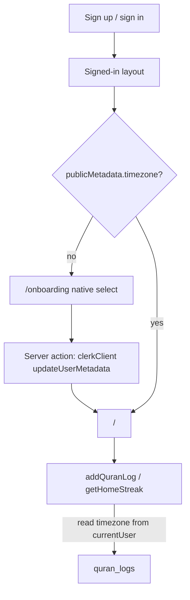

# Timezone onboarding via Clerk public metadata

## Why

Timezone is only used to compute the user’s local calendar day for logs and streaks. It currently lives on `[users](src/db/schema.ts)` and is filled by `[src/app/api/webhooks/route.ts](src/app/api/webhooks/route.ts)` using **the server’s** `Intl` timezone (not the user’s). Clerk already owns identity; public metadata is enough.




## 1. Drop the `users` table

In `[src/db/schema.ts](src/db/schema.ts)`:

- Remove `users`, `usersRelations`, and `quranLogsRelations`.
- Keep `quranLogs.userId` as `varchar` (Clerk user id) **without** a foreign key.

Then `pnpm db:push` so Neon drops `users` and the FK. Existing `quran_logs` rows stay keyed by Clerk id.

Delete `[src/app/api/webhooks/route.ts](src/app/api/webhooks/route.ts)` (and remove the Clerk `user.created` webhook in the dashboard when convenient).

## 2. Read timezone from Clerk, not the DB

In `[src/server/actions.ts](src/server/actions.ts)`, `requireClerkUserId` already loads `currentUser()`. Extend it (or a small helper in e.g. `[src/lib/timezone.ts](src/lib/timezone.ts)`) to read `publicMetadata.timezone`.

- Valid string → use it for `todayInTimezone` / `yesterdayInTimezone`.
- Missing/invalid → return a dedicated error (replace `db_user_not_found`). Home can `redirect("/onboarding")` when streak load fails for that reason; check-in should not insert a log without a timezone.

Use `currentUser().publicMetadata` (Backend API), not session JWT claims, so a save is visible immediately without a Clerk JWT template change.

Save with merge, not replace:

```ts
const client = await clerkClient()
await client.users.updateUserMetadata(userId, {
  publicMetadata: { timezone },
})
```

Validate the string with `Intl.DateTimeFormat(undefined, { timeZone })` before writing.

## 3. Minimal onboarding UI

Add `[src/app/onboarding/page.tsx](src/app/onboarding/page.tsx)`:

- If already signed in **and** metadata has a timezone → `redirect("/")`.
- Tiny client form: native `<select>` + one Continue button. No combobox, search, or extra shadcn components.
- Options: `Intl.supportedValuesOf("timeZone")`.
- Default: `Intl.DateTimeFormat().resolvedOptions().timeZone` (browser).
- Submit → server action `saveTimezone` → `redirect("/")`.

Gate the home page in `[src/app/page.tsx](src/app/page.tsx)`: if the signed-in user has no timezone, `redirect("/onboarding")`.

Keep the root `[layout.tsx](src/app/layout.tsx)` signed-out vs signed-in split as-is; onboarding is just another signed-in child.

## 4. Existing users

Anyone already in Clerk without `publicMetadata.timezone` (including people who only had a DB row) will see onboarding once. No copy from the dropped `users` table.


