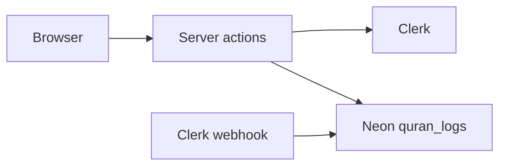

# Quran Tracker

A daily Quran reading check-in. Sign in, pick your timezone once, then tap to log that you read today. Streaks follow your local calendar day, including around DST.

**Live demo:** [quran-tracker.vercel.app](https://quran-tracker.vercel.app)

## Stack

| Layer | Choice |
| --- | --- |
| App | Next.js 16 (App Router), React 19, TypeScript |
| Auth | Clerk |
| Database | Neon Postgres + Drizzle ORM |
| UI | Tailwind CSS v4, shadcn/ui |
| Hosting | Vercel |

## Architecture

Clerk owns identity and the user's IANA timezone (`publicMetadata.timezone`). Neon stores only `quran_logs`. Current and longest streaks are derived from those dates, not stored as columns. When a Clerk user is deleted, a verified webhook removes their rows.



## Setup

1. Copy env vars and fill in Neon + Clerk values:

   ```sh
   cp .env.example .env
   ```

2. Install and apply migrations:

   ```sh
   pnpm install
   pnpm db:migrate
   ```

3. Run the app:

   ```sh
   pnpm dev
   ```

Use `pnpm db:migrate` for schema changes in production. `pnpm db:push` is a shortcut for throwaway local databases only.

Required variables are listed in [`.env.example`](.env.example): `DATABASE_URL`, `NEXT_PUBLIC_CLERK_PUBLISHABLE_KEY`, `CLERK_SECRET_KEY`, and `CLERK_WEBHOOK_SIGNING_SECRET`.

## Scripts

| Script | Purpose |
| --- | --- |
| `pnpm dev` | Next.js dev server |
| `pnpm test` | Unit tests (streak + date helpers) |
| `pnpm typecheck` / `pnpm lint` | TypeScript and ESLint |
| `pnpm db:generate` | Create a Drizzle migration from `src/db/schema.ts` |
| `pnpm db:migrate` | Apply committed migrations |

## Clerk account deletion webhook

When a Clerk user is deleted, `POST /api/webhooks/clerk` removes their `quran_logs` rows. Configure this in the Clerk Dashboard (Webhooks):

1. Endpoint URL: `https://<your-host>/api/webhooks/clerk` (production) or a Clerk CLI tunnel for local testing.
2. Subscribe to **`user.deleted` only**.
3. Set `CLERK_WEBHOOK_SIGNING_SECRET` to the endpoint signing secret locally and in Vercel (Production / Preview).

Local forwarding:

1. Install the [Clerk CLI](https://clerk.com/docs/guides/development/cli/overview).
2. Run:

   ```sh
   clerk webhooks listen --forward-to http://localhost:3000/api/webhooks/clerk
   ```

3. In Clerk Dashboard → Configure → Developers → Webhooks, add an endpoint with the URL the CLI printed (for example `https://webhooks.clerk.com/in/...`). Do not append `/api/webhooks/clerk` to that tunnel URL.
4. Enable account deletion in Clerk if users should delete themselves from `<UserButton />`.
5. Send a test `user.deleted` event from the webhook's Testing tab and confirm it reaches the CLI and your app.
